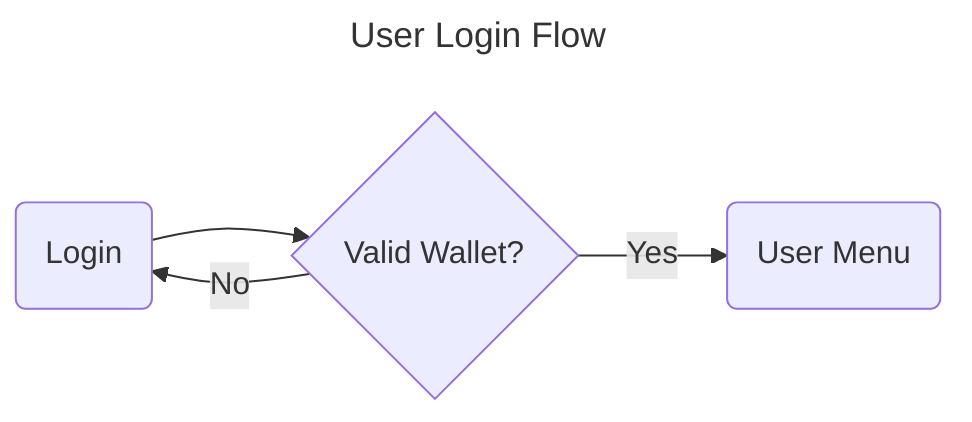
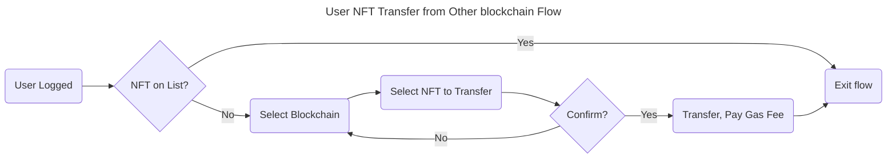
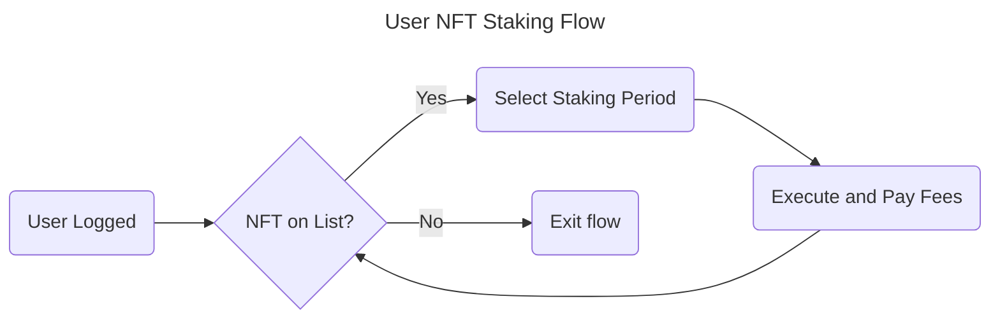
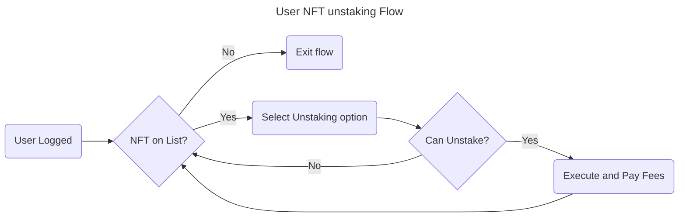

# 2. Analysis

Date: 2024-08-25

## Status

Draft

## Context

### Explore the problem

Consider an NFT collection that belongs to different L1 blockchains. Adding more functionality implies to develop these functionalities for every blockchain. Having a unique blockchain speed development new features that would be impossible to do on different blockchains.

### Scenarios and User Stories documentation

In this point we **express the needs that the user have in a form of user stories. It specifies the outcome that the user need**

#### 1. User Login



```gherkin
Feature: User Login
  As a user
  I want to be able to log in with valid credentials
  So that I can access the system

Scenario: Valid login
  Given I have provided valid username and password
  When I submit the login form
  Then I should see the Books Selection Flow page

Scenario: Invalid login
  Given I have provided invalid username or password
  When I submit the login form
  Then I should be prompted to re-enter my credentials
  And I will not see the Books Selection Flow page
```

- [Acceptance Criteria](ac/0001-user-login.md)

#### 2. User NFT Transfer from Other blockchain Flow



> [!NOTE]  
> Should we consider from lazy chain to send back to origin blockchains?
> [!IMPORTANT]
> Add gherkin scenarios

#### 3. User NFT Staking Flow



> [!IMPORTANT]
> Add gherkin scenarios

#### 4. User NFT Unstaking Flow



> [!IMPORTANT]
> Add gherkin scenarios

## Decision

## Consequences

What becomes easier or more difficult to do, and any risks introduced by the change that will need to be mitigated.
