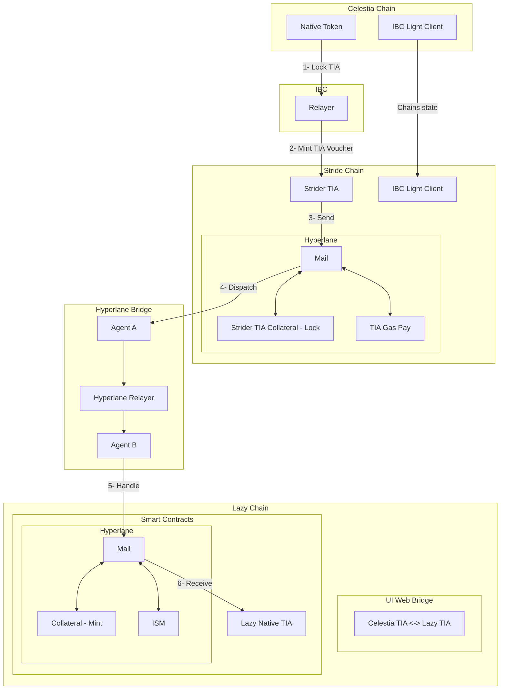
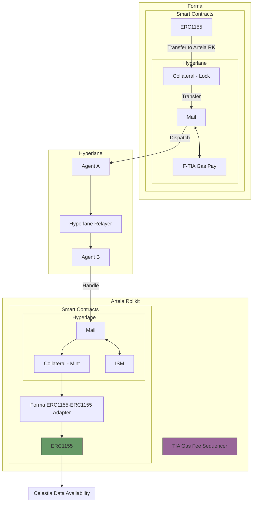
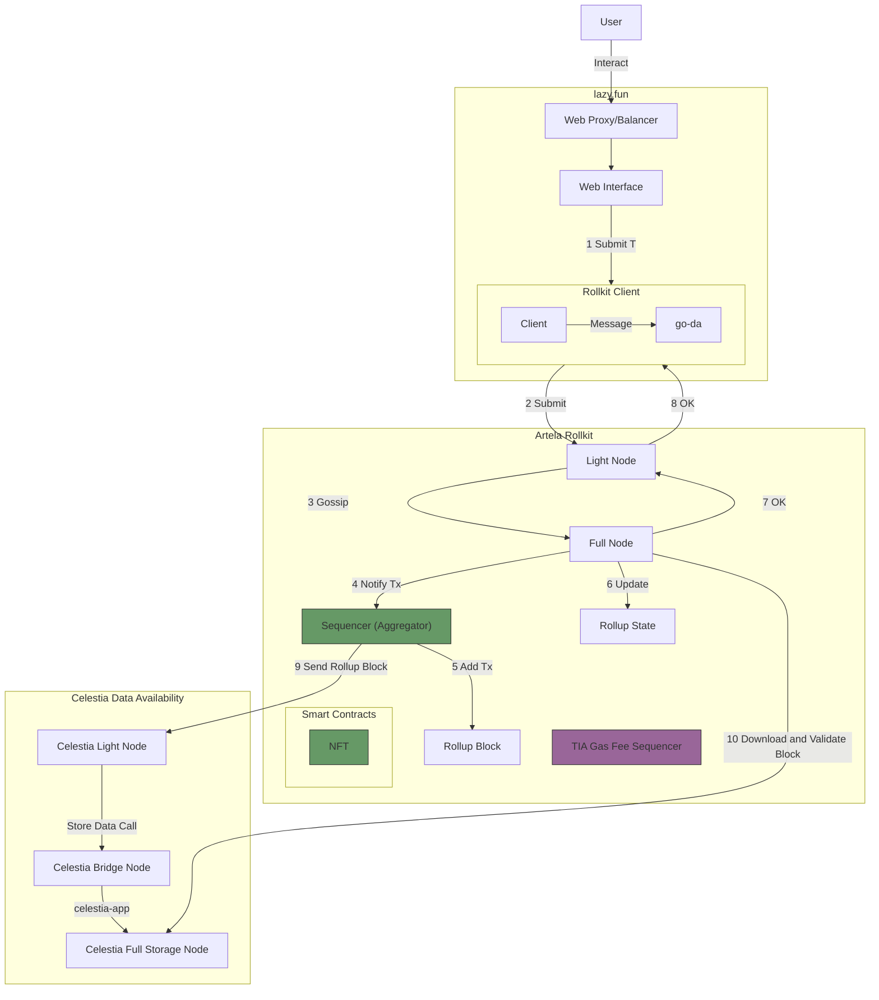
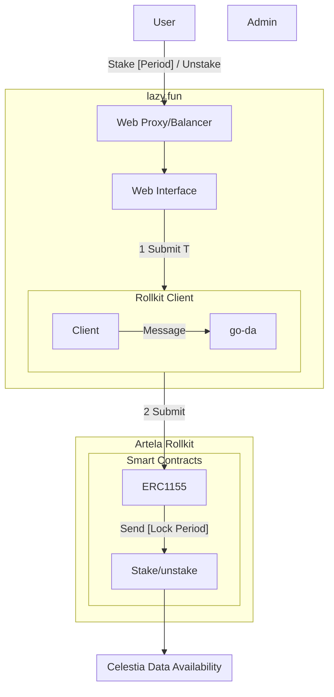
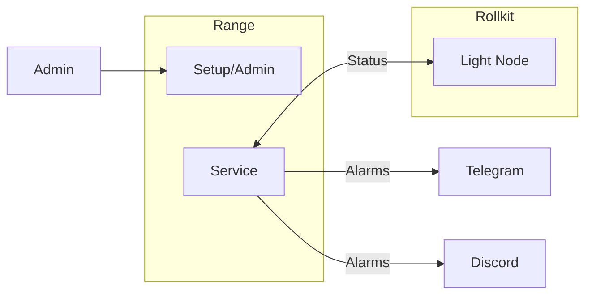

# 3. Design

Date: 2024-08-25

## Status

DRAFT

## Context

Celestine Sloth Society wants to have his own blockchain to evolve his main product NFT collection.
We are going to use a **modular blockchain** using **Sovereign Rollups** using Artela EVM++ as **Execution Layer**, **Rollkit** as **Settlement and consensus** layer (**cometBFT**) and **Celestia** as **Data Availability** layer.

## Main Goal

- Create a **modular blockchain** using **Sovereign Rollups** using Artela EVM++ as **Execution Layer**, **Rollkit** as **Settlement and consensus** layer (**cometBFT**) and **Celestia** as **Data Availability** layer.
- Transfer NFT Collections from other blockchains.
- Allow users to Stake their NFT.

## Sub Goals

- The system should be distributed, secure and scalable.

### Links

- [Forma Bridge](https://www.stride.zone/blog/stride-s-hyperlane-bridge-deployment-is-live-bridge-tia-to-forma)
- [Forma sdk](https://github.com/forma-dev/sdk/tree/main/contracts)
- [Celestia](https://celestia.org/what-is-celestia/)
- [RollKit](https://rollkit.dev/tutorials/artela-evm-plus-plus)
- [Hyperlane](https://docs.hyperlane.xyz/docs/deploy-hyperlane)
- [Artela](https://docs.artela.network/develop)

### UML

#### Gas Bridge (Celestia TIA - Lazy TIA)

> [!IMPORTANT]
> Add sequence diagram
> **Tasks**

- Lazy TIA **ERC1155** smart contract using Solidity
  - [eip-1155](https://eips.ethereum.org/EIPS/eip-1155)
  - [Forma 1155 and 721](https://github.com/forma-dev/sdk/tree/main/contracts)
  - Receive ok / Refund is handle by Hyperlane bridge?
- Define warp routes for Hyperlane Bridge
  - [deploy-warp-route](https://docs.hyperlane.xyz/docs/guides/deploy-warp-route})
  - [Submit to Registry](https://github.com/changesets/changesets/blob/main/docs/adding-a-changeset.md)
- Create a Bridge UI
  - [deploy-warp-route-UI](https://docs.hyperlane.xyz/docs/guides/deploy-warp-route-UI#fork--customize-the-ui)
  - [Example](https://github.com/forma-dev/hyperlane-bridge-ui)

#### NFT Transfer from StarGaze

> [!IMPORTANT]
> Add sequence diagram
> **Tasks**

- Lazy TIA **ERC1155** smart contract using Solidity
  - [Forma 721](https://github.com/forma-dev/sdk/tree/main/contracts)
  - Receive ok / Refund is handle by Hyperlane bridge?
- Define warp routes for Hyperlane Bridge
  - [deploy-warp-route](https://docs.hyperlane.xyz/docs/guides/deploy-warp-route})
  - [Submit to Registry](https://github.com/changesets/changesets/blob/main/docs/adding-a-changeset.md)
- Create a Bridge UI for NFT
  - [deploy-warp-route-UI](https://docs.hyperlane.xyz/docs/guides/deploy-warp-route-UI#fork--customize-the-ui)
  - [Example](https://github.com/forma-dev/hyperlane-bridge-ui)

#### NFT Transfer from FORMA

> [!IMPORTANT]
> Add sequence diagram
> **Tasks**

- Lazy TIA **ERC1155** smart contract using Solidity
  - [Forma 721](https://github.com/forma-dev/sdk/tree/main/contracts)
  - Receive ok / Refund is handle by Hyperlane bridge?
- Define warp routes for Hyperlane Bridge
  - [deploy-warp-route](https://docs.hyperlane.xyz/docs/guides/deploy-warp-route})
  - [Submit to Registry](https://github.com/changesets/changesets/blob/main/docs/adding-a-changeset.md)
- Create a Bridge UI for NFT
  - [deploy-warp-route-UI](https://docs.hyperlane.xyz/docs/guides/deploy-warp-route-UI#fork--customize-the-ui)
  - [Example](https://github.com/forma-dev/hyperlane-bridge-ui)

#### Data Availability Flow

> [!IMPORTANT]
> Add sequence diagram
> Research what tasks do we need here?

#### NFT ERC1155

> [!IMPORTANT]
> Add functions flowchart

#### STAKE

> **Tasks**

- Solidity Smart contract [cw-nft-staking](https://github.com/Lazychain/cw-nft-staking)
- Web UI [nft-staking-app](https://github.com/thirdweb-example/nft-staking-app)

#### Monitoring

> **Tasks**

- Create account into Range
- Setup Telegram and Discord Alarms
- Setup Service backend (RPC)
  
### Prototyping

- Implementation
- Unit Tests
- Integration Tests

## Decision

The change that we're proposing or have agreed to implement.

## Consequences

What becomes easier or more difficult to do and any risks introduced by the change that will need to be mitigated.
